# Part 1 Getting your bearings

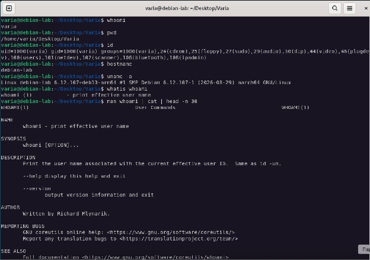

**Q1:** What username are you logged in as?  
**Answer:** varia  
**Q2:** Are you a member of the sudo group? How can you tell from the output of id?  
**Answer:** Yes, 27(sudo)  
**Q3:** What kernel version is your system running?  
**Answer:** 6.12.107+deb13-arm64  
**Q4:** What is the difference in the depth of information they give you?  
**Answer:** whatis gives a one-line description, man gives the full manual  
**Q5:** While in man, how do you (a) search for the word "user" and (b) quit?  
**Answer:** (a) /user \+ Enter, (b) q

# Part 2 Navigation

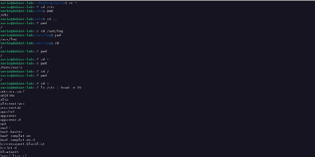

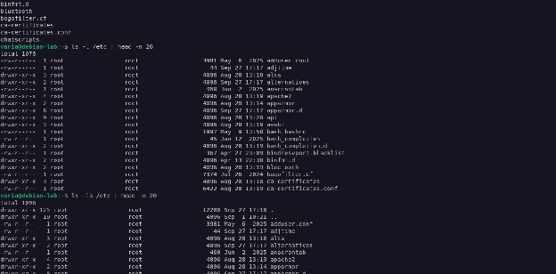

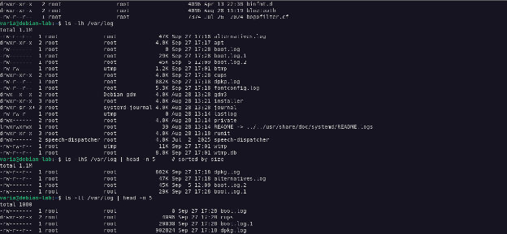

**Q6:** What did cd \- do?  
**Answer:** Returned to the previous opened directory (/etc).  
**Q7:** What additional information does \-l give you over plain ls?  
**Answer:** Permissions, link count, owner, group, size, modification date.  
**Q8:** What does \-a show that wasn't visible before? Name two examples from the output.  
**Answer:** Shows hidden files (starting with a dot), e.g. . and ..  
**Q9:** What is the largest file in /var/log? What size is it?  
**Answer:** dpkg.log, 882K  
**Q10:** What was modified most recently?  
**Answer:** boot.log

# Part 3 Creating and managing files

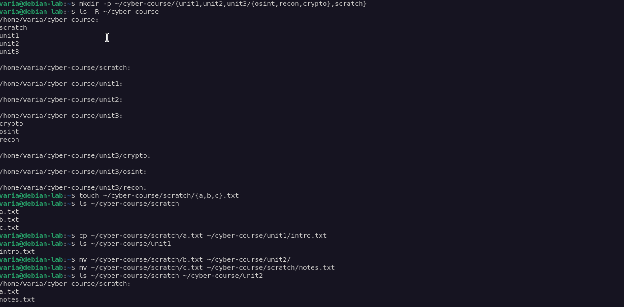

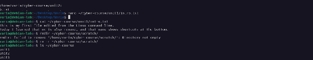

**Q11:** Show the command (or commands) you used.  
**Answer:** mkdir \-p \~/cyber-course/{unit1,unit2,unit3/{osint,recon,crypto},scratch}  
**Q12:** What key combination did you use to save? What key combination did you use to exit?  
**Answer:** Save: Ctrl+O, Enter. Exit: Ctrl+X  
**Q13:** Why did rmdir fail (or succeed)?  
**Answer:** Failed, because the directory is not empty. Removed with rm \-r 

# Part 4 Viewing files

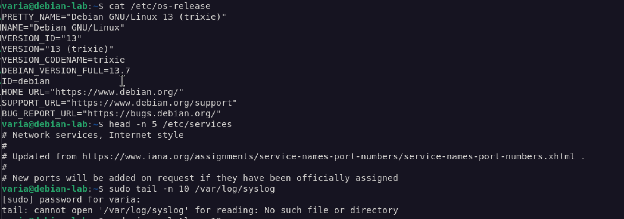

**Q14:** Which Debian version do you have?  
**Answer:** 13 Trixie  
**Q15:** What kind of messages do you see? Are they recent?  
**Answer:** /var/log/syslog does not exist

# Part 5 Searching

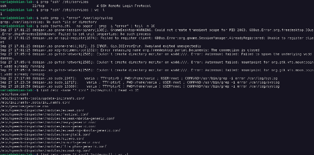

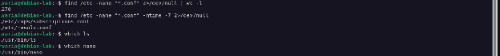

**Q16:** How many lines were returned?  
**Answer:** 1  
**Q17:** How would you modify the command to show only .conf files modified in the last 7 days?  
**Answer:** find /etc \-name "\*.conf" \-mtime \-7  
**Q18:** Where are these commands actually located on the filesystem?  
**Answer:** /usr/bin/ls, /usr/bin/nano

# Part 6 History, redirection, and pipes

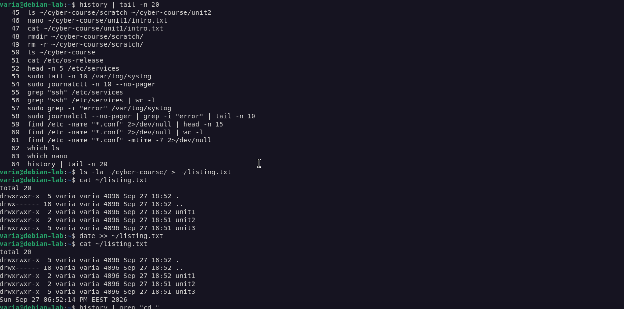

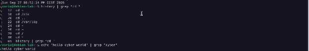

**Q19:** What does the | symbol do here?  
**Answer:** Sends the output of history as input to tail.  
**Q20:** What is the difference between \> and \>\>?  
**Answer:** \> overwrites the file, \>\> appends to it.  
**Q21:** What was the output, and why?  
**Answer:** “hello cyber world”, because the line contains "cyber".

# Part 7 Archives

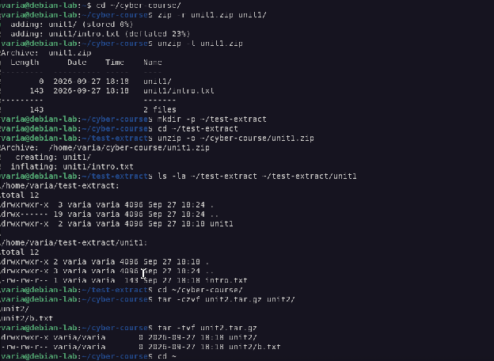

**Q22:** Confirm with ls \-la that the extraction worked. What did you find inside?  
**Answer:** unit1/ with intro.txt  
**Q23:** What do the flags c, z, v, and f each mean?  
**Answer:** c \= create, z \= gzip compress, v \= verbose, f \= archive file name

# Part 8 Permissions

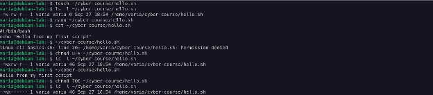

**Q24:** Paste the permission string. Can the owner execute the file?  
**Answer:** \-rw-r--r--, no  
**Q25:** What happened, and why?  
**Answer:** Permission denied, the file has no execute permission.  
**Q26:** What does the new permission string look like? Did the script run this time?  
**Answer:** \-rwxr--r--, yes  
**Q27:** What does 700 mean in plain language?  
**Answer:** Owner can read, write and execute; group and others have no access.

# Part 9 Processes and system info

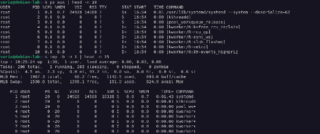

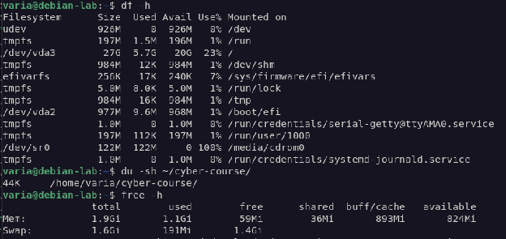

**Q28:** What does the USER column show?  
**Answer:** The user who owns the process.  
**Q29:** How much disk space is your cyber-course directory using?  
**Answer:** 44K  
**Q30:** How much RAM does your VM have, and how much is currently used?  
**Answer:** Total 1.9Gi, used 1.1Gi

# Part 10 Networking and downloads

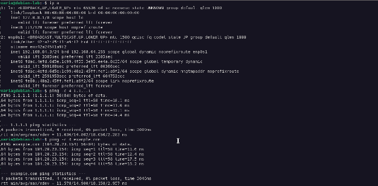

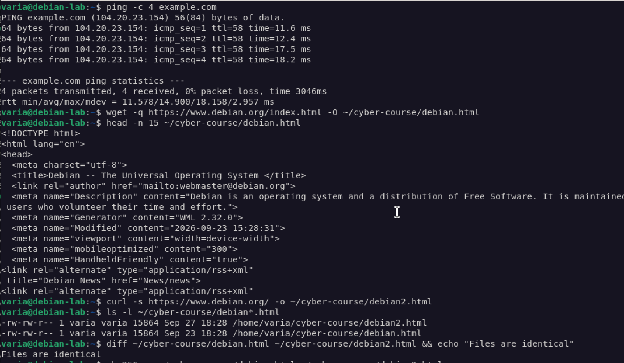

**Q31:** What is your VM's IP address on the primary interface?  
**Answer:** 192.168.64.3  
**Q32:** Did both succeed? If one failed, what is the most likely reason?  
**Answer:** Yes, both succeeded.  
**Q33:** Are the two files identical?  
**Answer:** Yes, diff shows no differences.

# Part 11 Package management and sudo

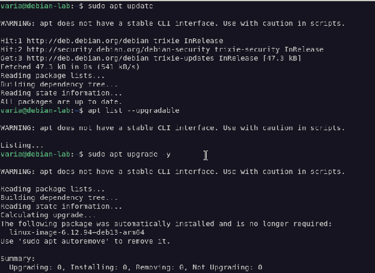

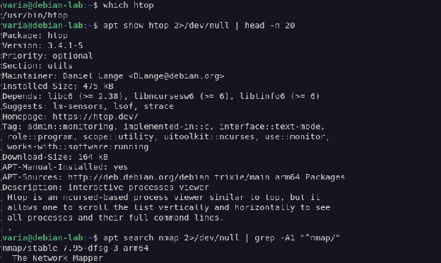

**Q34:** Did sudo ask for a password? Whose password?  
**Answer:** Yes, my own user's password (varia).  
**Q35:** Were any packages upgraded? Roughly how many?  
**Answer:** No  
**Q36:** What's one thing htop shows you that top did not?  
**Answer:** Per-CPU usage bars and colored memory bars.  
**Q37:** What is nmap, according to the description?  
**Answer:** The Network Mapper

# Part 12 Putting it together

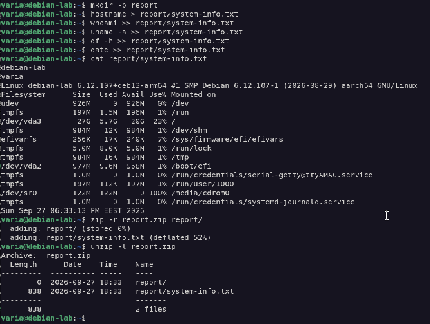

**Q38:** Paste the commands you used.  
**Answer:**  
mkdir report  
hostname \> report/system-info.txt  
whoami \>\> report/system-info.txt  
uname \-a \>\> report/system-info.txt  
df \-h \>\> report/system-info.txt  
date \>\> report/system-info.txt  
zip \-r report.zip report/  
unzip \-l report.zip

Source: https://docs.google.com/document/d/1VFg6hKAKhbQV-sDws9Hvn_2FMEU1WoxDjNaCUs8ASEc/edit?tab=t.0
