# Assignment: Shell Scripting Basics 


**Date:** 2026-09-8

**Source:**  U1-06b Assignment: Shell Scripting Basics 

**Environment:** Debian VM

## Goal

Customize the shell through `~/.bashrc` (banner, aliases, history limits) and write a first script using variables, user input, conditionals and loops.

# Part 1 Exploring your ~/.bashrc

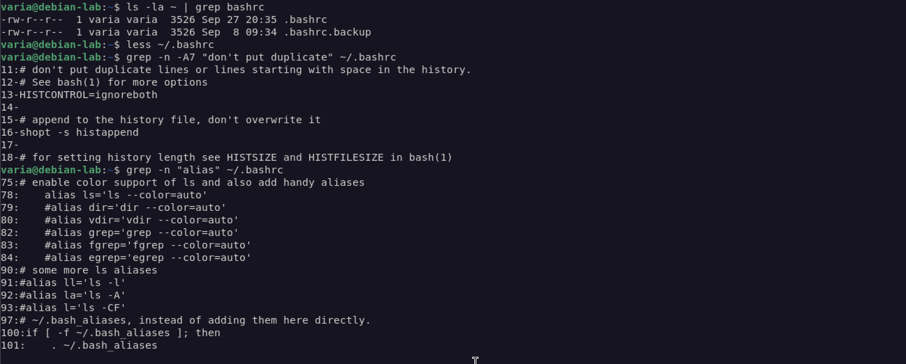

**Q1:** Paste the line. What size is the file? When was it last modified?

```bash
ls -la ~ | grep bashrc
```

```text
-rw-r--r--  1 varia varia  3526 Sep  8 09:34 .bashrc
```

**Answer:** 3526 bytes, last modified Sep  8 09:34

**Q2:** Find one section that contains comments explaining what it does. Paste a 3–5 line excerpt and explain in one sentence what that section does.

```bash
# append to the history file, don't overwrite it
shopt -s histappend

# for setting history length see HISTSIZE and HISTFILESIZE in bash(1)
HISTSIZE=1000
HISTFILESIZE=2000
```

**Answer:** This section controls history: new commands are appended to `~/.bash_history` instead of overwriting it, and it sets how many commands are kept in memory and in the file.

**Q3:** Are any aliases already set up by Debian's default .bashrc? Name two.

**Answer:** Yes: `alias ls='ls --color=auto'` and `alias grep='grep --color=auto'` (also `fgrep`, `egrep`). `ll`, `la`, `l` are there too, but commented out.

# Part 2 Backup before editing

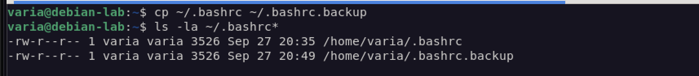

**Q4:** Paste the output. Confirm you have both .bashrc and .bashrc.backup.

```bash
cp ~/.bashrc ~/.bashrc.backup
ls -la ~/.bashrc*
```

```text
-rw-r--r-- 1 varia varia 3526 Sep 27 20:35 /home/varia/.bashrc
-rw-r--r-- 1 varia varia 3526 Sep 27 20:46 /home/varia/.bashrc.backup
```

**Answer:** Yes, both `.bashrc` and `.bashrc.backup` exist and have the same size.

# Part 3 Adding a welcome banner

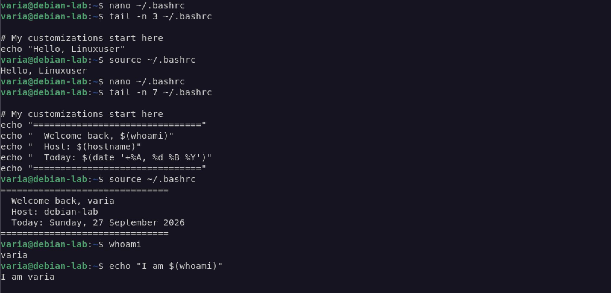

**Q5:** What appears at the top of the new terminal?

**Answer:** `Hello, Linuxuser`

**Q6:** Paste the banner output you see.

```text
===============================
  Welcome back, varia
  Host: debian-lab
  Today: Sunday, 27 September 2026
===============================
```

**Q7:** What does `$(whoami)` do? Why are the dollar sign and parentheses there?

**Answer:** It is command substitution: bash runs `whoami` and puts its output (`varia`) into the text. Without `$( )`, `echo` would just print the word "whoami".

# Part 4 Adding aliases

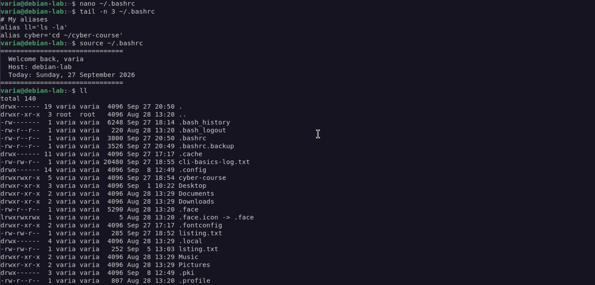
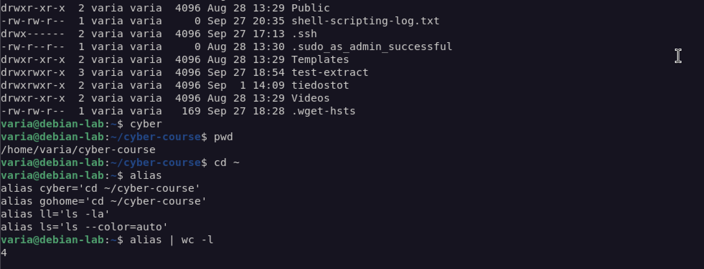

**Q8:** Paste the two aliases you defined and the output when you ran them.

```bash
# My aliases
alias ll='ls -la'
alias cyber='cd ~/cyber-course'
```

```bash
ll
cyber
pwd
```

```text
/home/varia/cyber-course
```

**Answer:** `ll` shows the long listing with hidden files, `cyber` jumps to `~/cyber-course`.

**Q9:** How many aliases are now defined in your shell?

```bash
alias | wc -l
```

**Answer:** 6 (`egrep`, `fgrep`, `grep`, `ls` from Debian + `ll`, `cyber`)

**Q10:** Why is one of your aliases useful for you specifically?

**Answer:** `cyber` saves typing `cd ~/cyber-course` every time, and that is where all my course work lives.

# Part 5 History settings

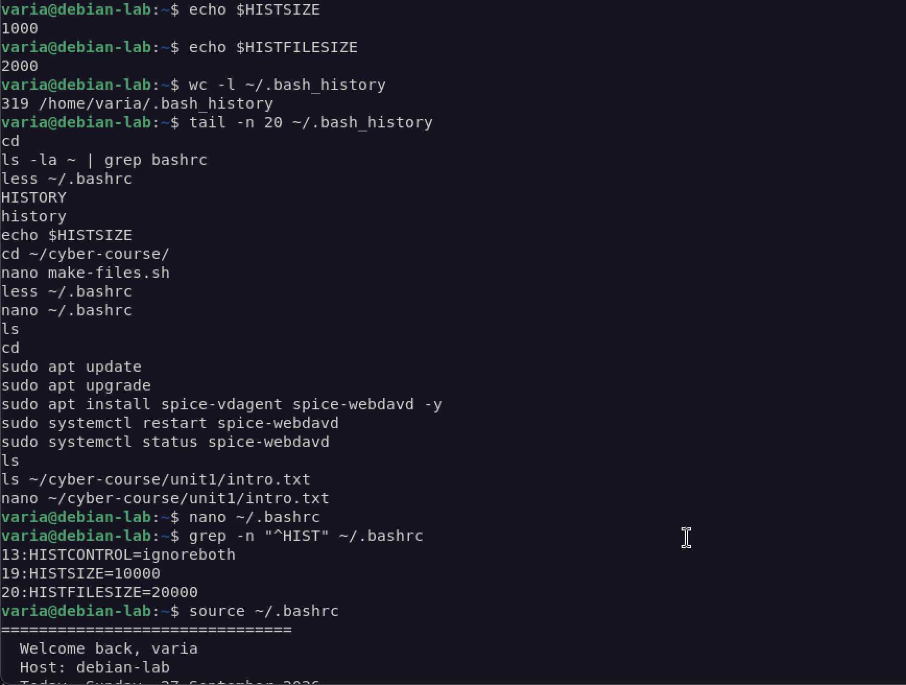
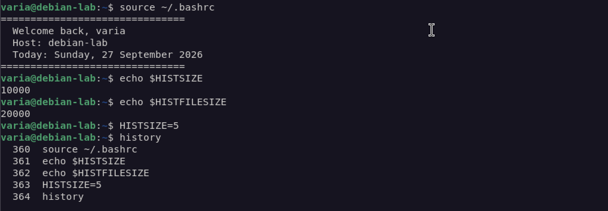

**Q11:** What are the default values on your system?

**Answer:** `HISTSIZE=1000`, `HISTFILESIZE=2000`

**Q12:** How many lines are in your history file? Paste the last 5 lines.

```bash
wc -l ~/.bash_history
tail -n 20 ~/.bash_history
```

**Answer:** 319 lines. Last 5:

```text
cd
ls -la ~ | grep bashrc
less ~/.bashrc 
HISTORY
history
```

**Q13:** What are the new values?

**Answer:** `HISTSIZE=10000`, `HISTFILESIZE=20000`

**Q14:** What changes? How many commands does `history` now show?

**Answer:** The history size dropped to 5. Only the last 5 commands are shown.

**Q15:** Name two reasons why someone with read access to your home folder might care what's in your history file.

**Answer:**
1. Secrets typed on the command line - passwords, API tokens.
2. Reconnaissance - it reveals servers, IPs, usernames, file paths and tools I use, which helps an attacker plan the next step.

# Part 6 Your first script

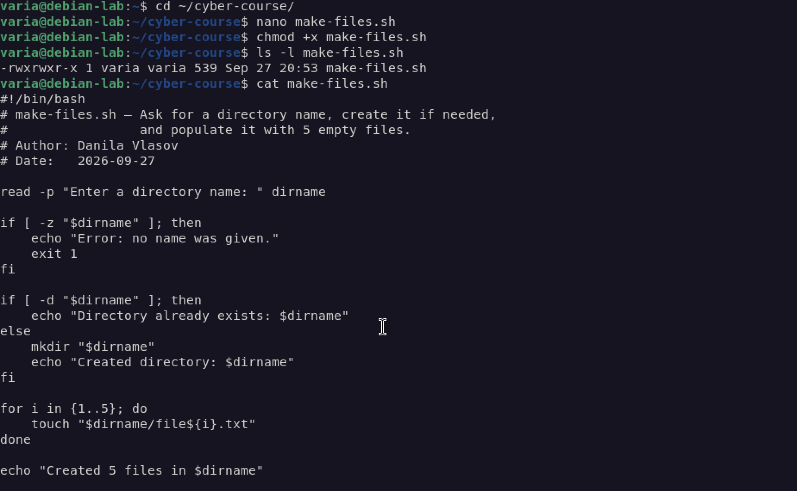

```bash
cd ~/cyber-course/
nano make-files.sh
chmod +x make-files.sh
```

# Part 7 Testing your script

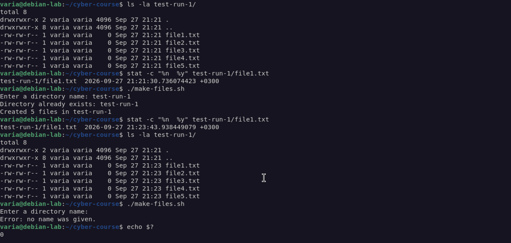

**Q16:** Paste the output. Then run `ls -la test-run-1/` and paste the result.

```text
Enter a directory name: test-run-1
Created directory: test-run-1
Created 5 files in test-run-1
```

```text
total 8
drwxrwxr-x 2 varia varia 4096 Sep 27 21:21 .
drwxrwxr-x 8 varia varia 4096 Sep 27 21:21 ..
-rw-rw-r-- 1 varia varia    0 Sep 27 21:21 file1.txt
-rw-rw-r-- 1 varia varia    0 Sep 27 21:21 file2.txt
-rw-rw-r-- 1 varia varia    0 Sep 27 21:21 file3.txt
-rw-rw-r-- 1 varia varia    0 Sep 27 21:21 file4.txt
-rw-rw-r-- 1 varia varia    0 Sep 27 21:21 file5.txt
```

**Q17:** What does the script say this time? Did it still try to create the 5 files? Does touch overwrite existing files?

```text
Enter a directory name: test-run-1
Directory already exists: test-run-1
Created 5 files in test-run-1
```

**Answer:** It says the directory already exists, but still runs the loop. `touch` does not overwrite existing files - their content stays the same, only the modification time is updated (seen with `stat` before and after).

**Q18:** What does the script do with empty input?

```text
Enter a directory name:
Error: no name was given.
```

**Answer:** It prints an error and stops with `exit 1`; nothing is created.

# Part 8 Reading and improving

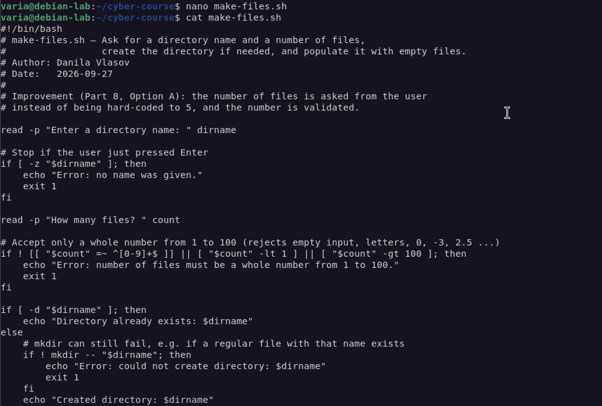
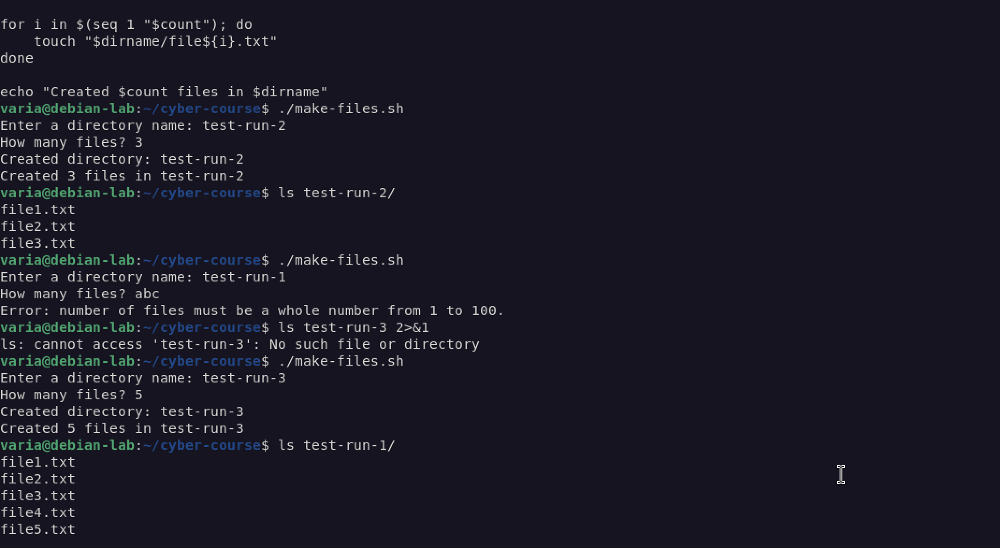

**Q19:** Which option did you pick, what does your modified script look like, and what does its output look like?

**Answer:** Option A - the script asks how many files to create. I also validate the number (only 1–100, no letters, empty input, 0 or negatives) and handle the case where `mkdir` fails.

```text
Enter a directory name: test-run-2
How many files? 3
Created directory: test-run-2
Created 3 files in test-run-2

Enter a directory name: test-run-3
How many files? abc
Error: number of files must be a whole number from 1 to 100.
```

## My ~/.bashrc additions

```bash
# My customizations start here
echo "==============================="
echo "  Welcome back, $(whoami)"
echo "  Host: $(hostname)"
echo "  Today: $(date '+%A, %d %B %Y')"
echo "==============================="

# My aliases
alias ll='ls -la'
alias cyber='cd ~/cyber-course'
```

History limits changed in place: `HISTSIZE=10000`, `HISTFILESIZE=20000`.

## Your final script

See [`make-files.sh`](make-files.sh) in this folder for the actual file. For reference:

```bash
#!/bin/bash

read -p "Enter a directory name: " dirname

# Stop if the user just pressed Enter
if [ -z "$dirname" ]; then
    echo "Error: no name was given."
    exit 1
fi

read -p "How many files? " count

if ! [[ "$count" =~ ^[0-9]+]] || [ "$count" -lt 1 ] || [ "$count" -gt 100 ]; then
    echo "Error: number of files must be a whole number from 1 to 100."
    exit 1
fi

if [ -d "$dirname" ]; then
    echo "Directory already exists: $dirname"
else
    if ! mkdir -- "$dirname"; then
        echo "Error: could not create directory: $dirname"
        exit 1
    fi
    echo "Created directory: $dirname"
fi

for i in $(seq 1 "$count"); do
    touch "$dirname/file${i}.txt"
done

echo "Created $count files in $dirname"
```

## Reflection

Editing `~/.bashrc` was easier than I expected. It is just a script that runs every time a terminal opens, so a banner or an alias is only one line. Making a backup first made me feel safe to experiment.

The harder part was the syntax of conditions. Spaces inside `[ ]` matter, variables must be quoted, and checking that input is really a number needed a regular expression. A missing space gives a confusing error instead of a clear one.

The most useful thing I learned about `.bashrc` is that it also controls history. From a security point of view, `~/.bash_history` is a plain text file that can leak passwords, tokens and server names, so a long history is convenient but also a risk. It also works the other way: on a compromised machine, the history file can show an investigator what an attacker ran.

Next I would like to write a script that checks a log (for example `journalctl` output) for failed `sudo` or SSH login attempts and prints a short daily summary. That is a routine security task that is worth automating.

